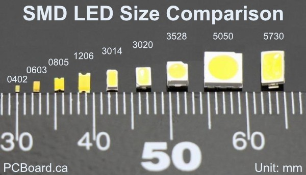
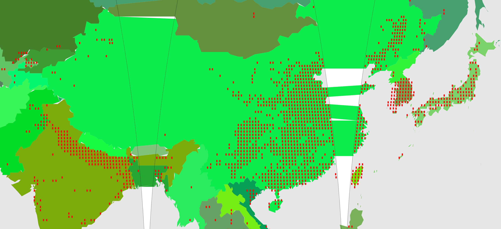
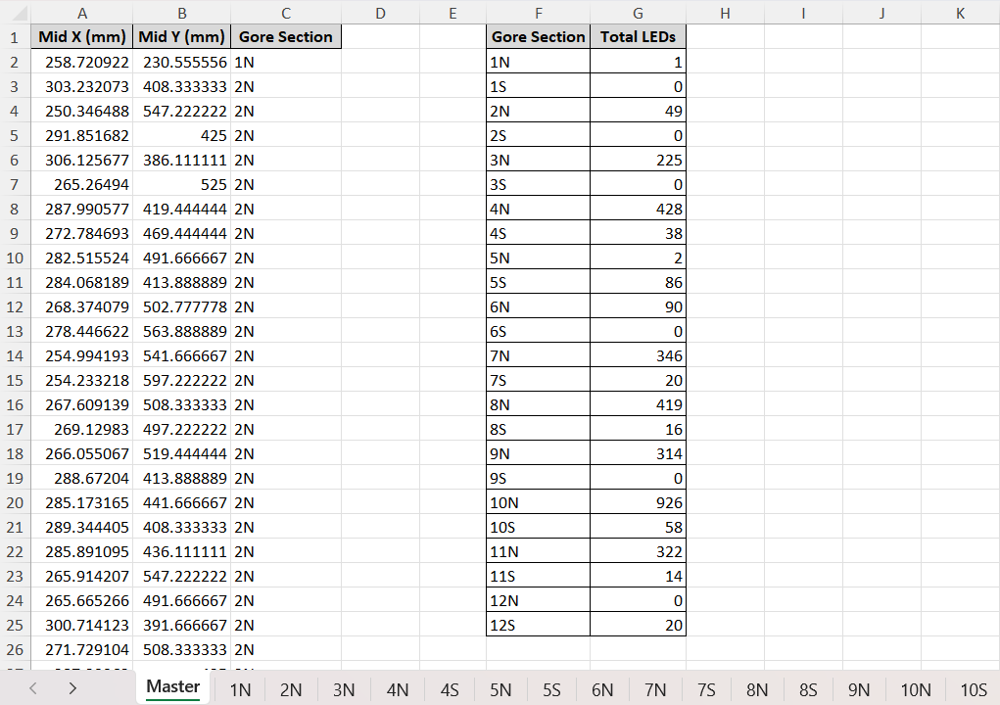

*this v2 branch is for implementing the nighttime lights rather than using population density*
This branch is still a work in progress. Current notes:
- added downsampled nightlight to /transients
- added rasterdownsampler to /src
- added testingNightlight and logHisto to /testingScripts
- could consider increasing resolution of shape file (i.e. not simplifying the geometry so much)
- need to udpate this readme to include the updates from the nightlight raster
- The cutting around the shape file has problematic implications for small places/coastlines, because it excludes tiles that could have LEDs. like hawaii maybe
   - Maybe, for situations where a tile is being sliced up (on edges) the cutting algorithm should assign the tile to the entity (country) that has the largest section of it. This way, if a tile is shared ex. 40% Canada, 30% USA, 30% ocean, then Canada gets the tile
- Could make shape file simplification for the geren country mapping less coarse; make it higher res for display purposes. The file size is large, but if we split it into 24 pieces anyway, this should help to alleviate this issue.
- see also the notes at the top of main

# Project Overview

This project is an **open-source platform for defining and exploring global energy distribution solutions**. It is designed to serve as a **template for building solution-based scenarios**, particularly focused on future energy systems like a **global solar grid** or other regional energy models. The goal is to help define the problem of energy distribution at a global scale, inviting others to **contribute** and use this **platform to explore potential solutions**.

The project uses a **1.27-metre-diameter spherical globe** made up of **12 gores** constructed from flexible printed circuit boards (PCBs) with surface-mounted LEDs. These 12 gores are divided in half at the equator, resulting in **24 total strips** of flexible PCB (each 1m x 0.333m in size). 

This program takes in geographical data *(shape file from Natural Earth)*, total energy usage per country *(sourced from Our World in Data)*, and a global population density raster *(GeoJSON sourced from SEDAC)*. It then outputs a scalable vector graphic of the 12 gores with countries and LED markers plotted, along with pick-and-place spreadsheets for PCB manufacturing.

### A Striking Visual Representation

While the primary aim of this project is to provide a **platform for problem-solving** in global energy distribution, it also serves as an **artistic and visually striking representation** of the world’s energy demand. The LED globe offers a powerful way to engage with global energy data through a tangible, functional model. This artistic element helps communicate the disparities in energy usage across regions and countries, making the data more accessible to a wider audience.

# Background

This 1.27 m diameter is no coincidence – this corresponds to 5.1 m2 of surface area, which is precisely 100 trillion times smaller than our Earth's surface area.
Taking the Earth's total annual energy consumption (*primary energy* – not just electricity) of ~172 PWh and computing an average power of 20.4 TW over 8760 hours per year, we find that the scaled-down power draw of our model Earth is just over 0.2 Watts. 
Using green 0805 SMD (surface-mounted device) LEDs, it was found that an acceptable brightness could be generated using a mere 23.7 μA (*yes – 0.0237 mA*) at 2.12 V. With a supplied power of 0.2 W, almost 4000 of these LEDs could be powered. 3500 LEDs was chosen to provide a decent balance of brightness and quantity.

If we imagine **all** of this energy being supplied by solar photovoltaic (PV) and neglect energy storage and losses in transmission, we would need about 102 TWp (*peak* or *rated*) of solar PV. This would correspond to about 500,000 km2 of solar PV, assuming a peak sun irradiance of 1000 W/m2, an average sun irradiance of 200 W/m2 (capacity factor of 0.2), and a PV module efficiency of 20%. This was based on the climate in Prince Edward Island, Canada, but this obviously varies by geography (and is significantly better near the equator!). This corresponds to **dedicating about 0.1% of the Earth's surface area** to solar power generation infrastructure – or  about 0.345% of its land surface area.

Alternatively, the analysis can be refined to calculate the PV required to replace only the portion of energy currently provided by fossil fuels (140 of the 172 PWh). For this, 80 TWp of solar would need to be installed, resulting in an area of 400 000 km² needed for the PV infrastructure. This would require just 0.0783% of the Earth’s surface area to be allocated to solar generation infrastructure, or 0.270% of its land mass.

With the calculated requirement of 0.1002% of Earth’s surface area to be dedicated to PV arrays, this results in a mere 51.1 cm2 of total area on the model: just larger than a **7 cm × 7 cm square**. Put out your hands and imagine this 7x7 cm square – this is enough to power the entire (scaled-down) globe! This supplies 1.02 Wp in the scaled-down sphere: an average power of 0.2 W. This would be enough power, on average, to run our 3500 LEDs at 2.12 V, 23.7 μA.

# Challenges and Learnings

### China's Energy Dominance
The first interesting finding was just how unequal the world's energy usage is when dividing by political boundaries. For instance, China uses about 28% of the world's primary energy! If we have ~3500 LEDs, China is allocated almost 1000 of them, as shown in the figure below. *Of course, China is also extremely populous. When it comes to per-capita energy usage, countries like Canada, Norway, and Iceland use far more energy per person than China.*

  
   
  <strong>Figure 1:</strong> Graph of Top 30 Countries by Primary Energy Consumption

This is only the top 30 countries – let's instead include all 212 entities (193 countries plus some dependencies, microstates, etc. included by *Our World in Data*). The dominance in energy consumption seen from the top few nations – particularly China – is incredible.

   
  
   
  <strong>Figures 2 and 3:</strong> Comparison of All Countries' Energy Consumption (Linear vs. Log Scale)

### Number of LEDs

Even with almost 3500 LEDs, we can only represent the top 113-consuming countries. This means that any entity that uses less energy than Moldova – including nations like Nepal, Cameroon, Latvia, Luxembourg, and the Democratic Republic of the Congo – will not be represented on the map with even one LED. For a small island nation like the Cook Islands (#204 on the list), we would need over 180,000 LEDs globally for Cook Islands to be allocated a single diode.

Now, we know how many LEDs that a given country should have, but how do we go about deciding where to place each LED within a given country? Given that energy usage rasters (geographical data) are not readily available at a global scale, the next best option that I thought of was using population density. These GeoTiff rasters are readily available in many resolutions and likely track well enough with energy usage that they would appear to be a reasonable analogue for energy usage to most viewers of the model globe. *In retrospect, it likely would have been better to use [Nighttime Lights](https://eogdata.mines.edu/products/dmsp/) instead, but that is future work.* Therefore, within a given country, let's say China, we will place its 970 allocated LEDs in its most densely-populated areas, and we will hope that these also closely align with the areas where most of China's energy is being used.

The following image shows the placement of the LEDs in QGIS:

  
   
  <strong>Figure 4:</strong> Placement of 3647 LED Markers on a Mercator Projection in QGIS

Zooming into North America, we can inspect the tessellation of the LED markers. This population density raster resolution (*30 arc-minute, approx. 55km*) was chosen specifically so that it could accommodate the size of an 0805 SMD LED footprint, which is about 3.5 mm long – snugly fitting inside of the ~3.6 mm side length of one of these tiles when scaled down.

  
   
  <strong>Figure 5:</strong> North American LED Markers and Population Density Raster in QGIS

For reference, here are the surface-mounted LEDs I'm referring to:

  
   
  <strong>Figure 6:</strong> SMD LEDs on a Millimetre Scale [<a href="https://www.pcboard.ca/led-0805" target="_blank">Source</a>]

### Transforming Mercator Projection Coordinates to Gores

Once we have the LEDs marked as coordinates in a GIS software, we then somehow need to get this beautiful creation from QGIS onto gores. Per [Wikipedia](https://en.wikipedia.org/wiki/Gore_(segment)), "A gore is a sector of a curved surface or the curved surface that lies between two close lines of longitude on a globe and may be flattened to a plane surface with little distortion". While we have selected a quantity of 12 gore slices and flexible PCB material, this is still a projection after all, and thus there will still be distortion when attempting to flatten spherical segments onto flat gore strips. 

Spiros Staridas created a beautiful 12-gore map which I used as a reference:

  
   
  <strong>Figure 7:</strong> "Twelve Stripes of the Globe" from Spiros Staridas [<a href="https://www.staridasgeography.gr/twelve-stripes-of-the-globe/" target="_blank">Source</a>]

Transforming this Mercator projection to gores is no simple task, as GIS softwares such as QGIS do not support interrupted map projections. Therefore, it was up to me (with the excellent help of ChatGPT) to create code that would perform the mathematical transformation from the latitude and longitude coordinates onto the flattened gore coordinates. This was the most intellectually challenging component of it, as we needed to account for the curvature of the Earth, adjust for the narrowing of the gores near the poles, and interpolate positions between the left and right boundaries of each gore based on latitude and longitude.

  
   
  
   
  <strong>Figures 8 and 9:</strong> GIFs Comparing Staridas' Gores to My Population Density Turbomap (Top) and SVG with Red LED Markers (Bottom)

# Results

### 12-Gore Scalable Vector Graphic Map

This leads us to the final visual result of the project: a 4000 mm wide by 2000 mm tall SVG. This graphic includes all 12 gores along with the 3467 LED markers as red rectangles of size 3.5 mm x 2 mm (the footprint of an 0805 SMD LED plus some small breathing room).

  
   
  <strong>Figure 10:</strong> Scalable Vector Graphic of the Gores Map with Red LED Markers

You can inspect this SVG simply by right-clicking the image and selecting *Open image in new tab*, or by downloading it from `/outputs` and opening it in the vector graphics editor of your choice. Note that the green "stretch marks" between gores are simply visual artifacts from the simplified multipolygonal countries being plotted across gore boundaries, and would not be included in the manufacturing. Editing out these stretch marks is a future task, and until then, they serve as a neat visual indicator of the deformation necessary to transform a sphere onto flat segments.

Figure 10 below enables you to see the rectangular LED markers more clearly. This figure also demonstrates just how closely packed the LEDs are for these highly populated nations.

  
   
  <strong>Figure 11:</strong> Zoomed Capture from the SVG of East Asia

 South Korea is a good example of the space limitations using this methodology – its landmass does not even have enough tiles to fit all of its 71 LEDs. I therefore needed to manually place the remaining LEDs around the coastline after the `led_allocator.py` script informed me that it could only automatically place 41 of its 71 allocated LEDs. Ten nations were in this predicament, such as Singapore, Bahrain, and the UAE.

### Pick-and-Place Coordinates for PCB Manufacturing

The other useful output from this project is the creation of an Excel workbook containing a sheet for each half-gore which contains LEDs, along with a Master sheet with the totals for each gore half. These sheets contain the X and Y coordinates of the centroid of each surface-mounted component in mm, which is the standard for electronic design automation (EDA).

  
   
  <strong>Figure 12:</strong> Screen Capture of Pick-and-Place Excel Workbook

Interestingly, as seen in Figure 12, there are six gore halves which contain zero LEDs – can you identify them on the SVG map?

# Future Work

- This project uses population density within a given country to determine where geographically the country's allocated LEDs should go, since energy usage rasters are not readily available (compared to population density rasters, which are). This should instead be changed to utilize actual energy usage rasters or using **nighttime light rasters**, like from [Earth Observation Group](https://eogdata.mines.edu/products/dmsp/).
- All LEDs are currently run electrically in parallel with equal current to provide the same brightness. However, in the future, it would be best to utilize current-limiting resistors (of the same 0805 SMD style) on the back of the flexible PCB in order to have **variable-brightness LEDs**. This would enable more energy-intensive nations like Singapore to have visually brighter LEDs rather than just more of them.
- **Draw the 51.1 cm2 area PV requirement**, likely as a square or circle, in the ocean just to show the size needed. Ideally, the PV would be real and would power the actual globe, perhaps using some sort of spotlight concentrated on this spot or even spread out logically around the globe in sensible places for PV (such as Nevada and other desert-like locations near the equator). This would mean adding locations for pads and vias for the solar cells to connect electrically.
- **Cut out the "stretch marks" between gores** in the SVG.
- **Add physical connections**, like tabs and/or zero-ohm resistors, added strategically at the edges of the gore halves to assemble them.
- There should be an option in the code to **isolate a specific half-gore** rather than displaying all 12 full gores.
- **Remove hard-coded variables**. Many of the functions are not appropriately generalizable using variables; num_gores, width, and height should really be editable in main and the script should function with arbitrary values, but those values are hardcoded in other scripts. There should also likely be some algorithmic checking to see if the proposed dimensions work with the proposed SMD sizes.
- Could add an option for users to do the population density turbo colourmap visual like in Figure 8; that was created during testing and is not currently part of this repo.
- Plan how to practically power/assemble/display this model whatever environment it will be displayed in.
- Represent the 33 "missing" LEDs somehow; the top 113 countries own the first 3467 of 3500, leaving the remaining 99 entities to somehow share the last 33 LEDs.

# Sources and Software Used

### Data Sources:
- [Energy Production and Consumption](https://ourworldindata.org/energy-production-consumption) from *Our World in Data* by Hannah Ritchie, Pablo Rosado and Max Roser in 2024.
    - Navigate down on the webpage to "Primary energy consumption, 2023", then download "Full data (CSV)". I cleaned and sorted the data and placed it in the `data/` folder. It is titled `Country Energy Data.xlsx`.
- [Gridded Population of the World (GPW), v4](https://sedac.ciesin.columbia.edu/data/set/gpw-v4-population-density-rev11/data-download) from *Socioeconomic Data and Applications Center (SEDAC)* in 2020.
    - Login required to download raster data. Select *Single Year*, *GeoTiff*, and *30 Minute (approx. 55km)*. It is titled `gpw_v4_population_density_rev11_2020_30_min.tif` in the `data/` folder.
    - The 30 arc-minute resolution was selected so that each tile in the raster would be able to accomodate an 0805 SMD LED, but depending on your needs/desires, you can select a different resolution.
- [Admin 0 – Countries](https://www.naturalearthdata.com/downloads/10m-cultural-vectors/10m-admin-0-countries/) from *Natural Earth* in 2022.
    - The shape file (`ne_10m_admin_0_countries.shp`) is the primary focus, but the `.cpg`, `.dbf`, and `.shx` supporting files are also necessary and are located in the `data/` folder.

### Useful Software:
- [QGIS](https://qgis.org/download/)
    - This free and open source GIS (Geographic Information System) tool was invaluable in the learning and development process. It enabled me to inspect and edit LED marker placements and view my vector and raster layers.
- [Inkscape](https://inkscape.org/release/inkscape-1.3.2/)
    - This free and open source vector graphics editor was useful for inspecting the SVG (Scalable Vector Graphics) outputs.
- [KiCad](https://www.kicad.org/download/)
    - This free software suite for EDA was useful for learning about the requirements and workflow for PCB manufacturing, particlarly with respect to the footprints of SMD LEDs.

# Credits

### Primary Author: Luke McCarvill
Many thanks to Dr. Andrew Swingler, my supervisor in the UPEI Faculty of Sustainable Design Engineering, for coming up with this idea and supporting the process. Riley Fitzpatrick, my coworker and fellow UPEI FSDE student, was also instrumental, particularly in the early stages of the project, performing many of the scaling and PV calculations. 

Thank you to Dr. Eric Galbraith of McGill University for the idea of using the nighttime lights instead of population density – this will hopefully be incorporated in future versions.

ChaptGPT (GPT-4o) was also used extensively in the programming and problem-solving process.

# Instructions for Installation and Usage

*This was my first Python project, and first project using Git, so my apologies if the files or instructions are not laid out intuitively. I used VS Code, which I recommend to use if you are also new to this area. These instructions should work regardless of what code editor you use, though.*

### 1. Clone the repository
First, clone the repository to your local machine:  

`git clone https://github.com/your-username/python-led-placing.git`  
`cd python-led-placing`

### 2. Install dependencies
Make sure you have Python 3.x installed. Install the required dependencies by running:  

`pip install -r requirements.txt`  

This will install the necessary Python libraries like geopandas, pandas, rasterio, and matplotlib.

### 3. Prepare Your Data Files
Ensure you have the following files correctly placed in the `data/` directory:
- Country shapefile: `ne_10m_admin_0_countries.shp` (including `.shx`, `.dbf`, etc.)
- Population density raster: `gpw_v4_population_density_rev11_2020_30_min.tif`
- Energy data Excel file: `Country Energy Data.xlsx`
Optional: If you have a previously edited GeoJSON file, place it in the `data/` directory and make sure only one `.geojson` file is present.

### 4. Adjust Parameters
In `main.py`, you can adjust the parameters to suit your project needs:
- `draw_gores`, `draw_countries`, `draw_leds`, `draw_equator`: Toggle whether to draw the gores, countries, LED markers, and/or equator.
- `manual_manipulation`: Set this to `True` to manually adjust LED positions via a GeoJSON file. The script will stop halfway through and allow you to edit the file in a GIS software. When satisfied with your edits, save the edited GeoJSON in the `/data` folder and then enable the `use_edited_geojson` flag.
- `use_edited_geojson`: Set this to `True` if you want to use a previously edited GeoJSON file. Ensure there is exactly one GeoJSON file in the `/data` folder (such as the one I've supplied based my own edits). The script will automatically load this file instead of generating a new one. If no such file exists or this flag is set to `False`, the script will generate a new GeoJSON file for manual manipulation.
- `create_coords_for_manufact`: Set this to `True` to create the pick-and-place spreadsheet with the LED coordinates on the gores.
- *In the future, the dimensions and number of gores variables will hopefully function with arbitrary values, but currently, those values are hardcoded.*

### 5. Run the Main Script
Run the `main.py` script to generate the 4000x2000mm SVG map:  

`python src/main.py`  

Make sure you close any open files (e.g., in QGIS or Excel) to avoid permission errors.

### 6. View the Output
- The output SVG will be shown in Matplotlib; this figure should pop up automatically if there are no errors. Close any existing open Matplotlib figures before running the script.
- The output SVG file will be saved in the `outputs/` folder as `full_map_4m_by_2m.svg`.
- If manual manipulation is enabled, a GeoJSON file will be saved in the `transients/` folder as `led_positions_for_manual_edit.geojson`. You can open this file in QGIS or another GIS tool to manually adjust LED positions.

### 7. Pick-and-Place File
If you enabled `create_coords_for_manufact`, a pick-and-place Excel file with the LED coordinates for each gore half will be created. Each sheet in the file corresponds to one gore half for manufacturing. This `gorehalf_coordinates_with_sheets.xlsx` will be found in the `/outputs` folder.

For manufacturing, the flexible PCB can be designed with two layers: one dedicated to 2.12 V and the other to 0 V. This strategy simplifies the design, similar to solar PV cell design, by eliminating the need for thousands of individual traces and ensuring even power delivery across all LEDs. Hooking up the power supply at the North Pole would also probably be best. Then, these strips can be placed on some sphere like an inflatable balloon or even a rigid ball.

### Contributing

Contributions are welcome! If you'd like to work on any of those "future work" items or have other ideas for improving this project, feel free to:

- **Fork the repository** and submit a pull request with your improvements.
- **Report issues** or bugs via GitHub's issue tracker.
- **Start discussions** and/or ask questions in the Discussions tab.  

