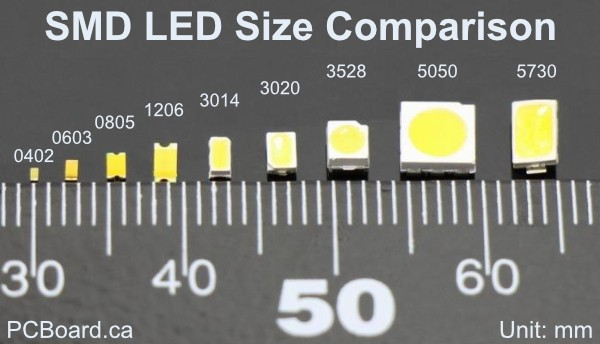
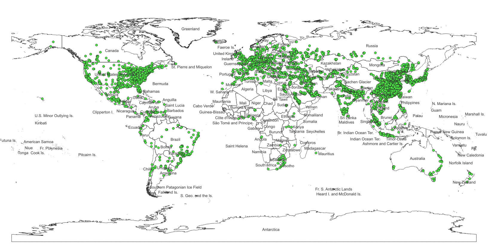
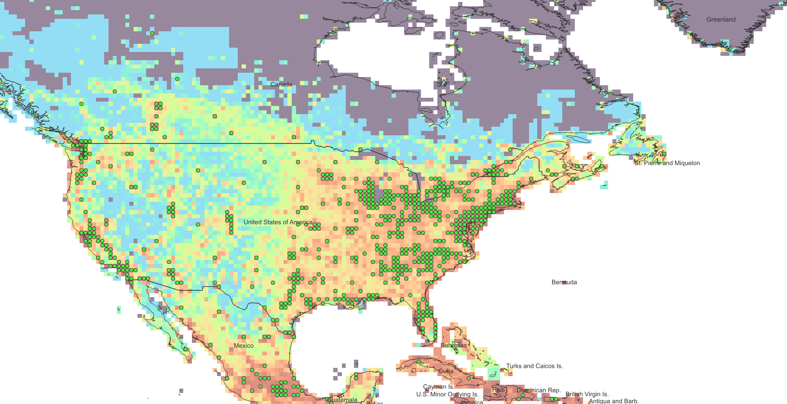
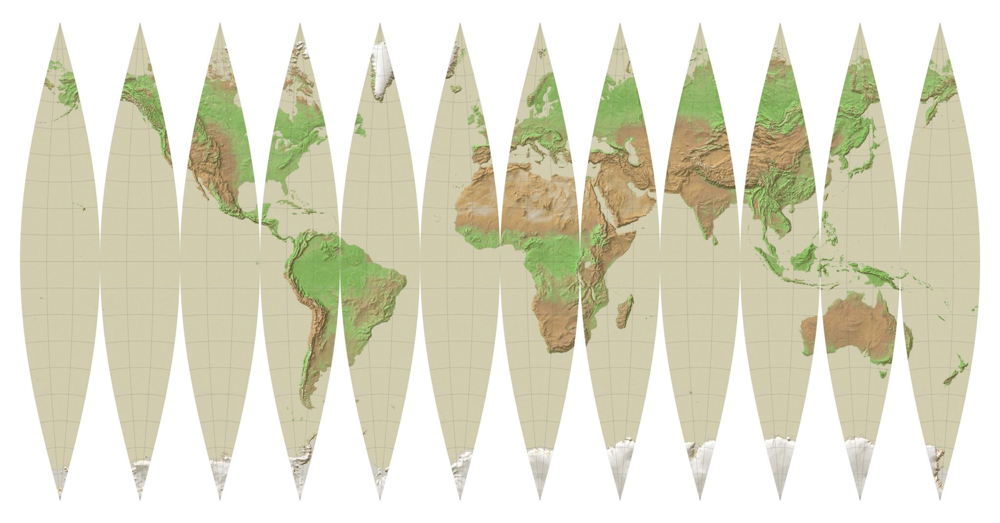
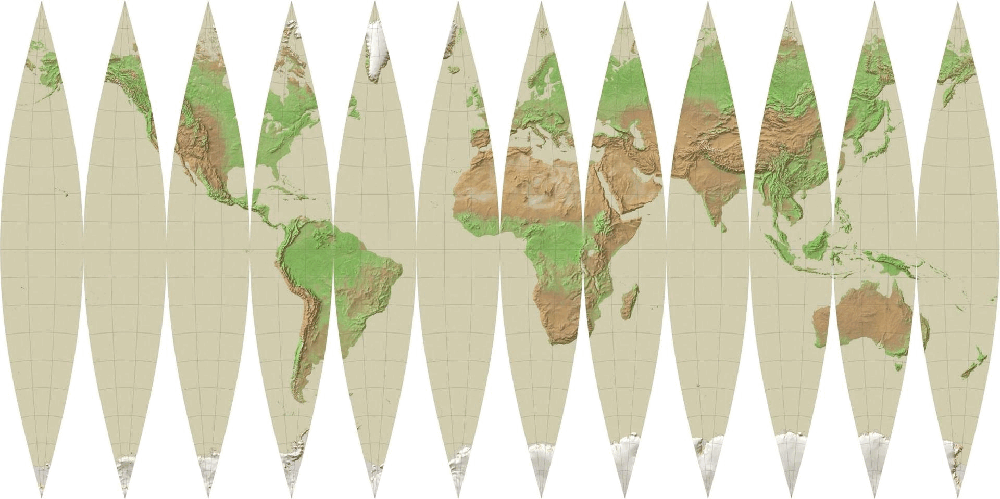
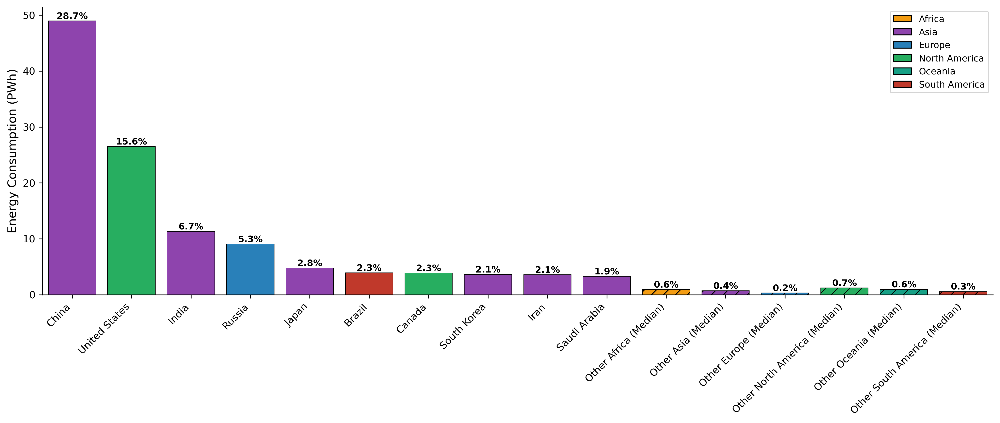
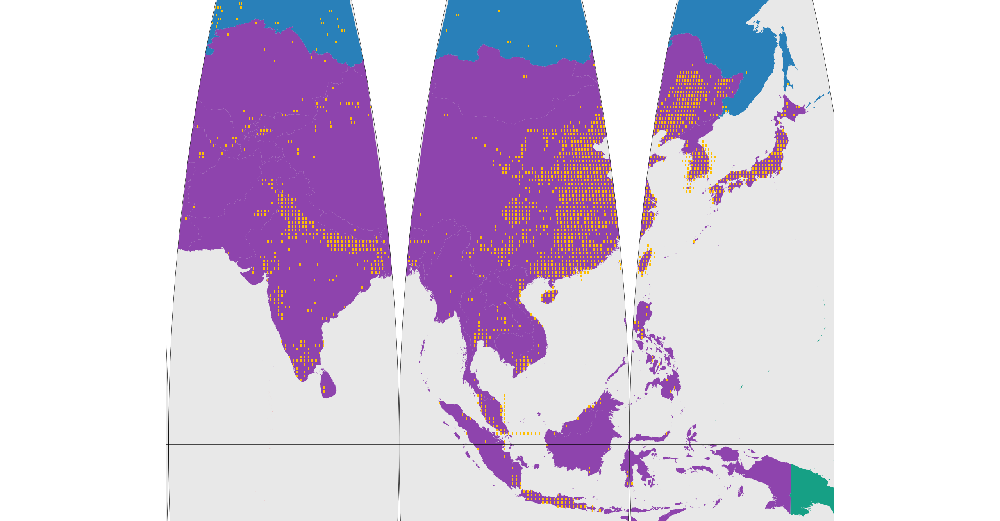
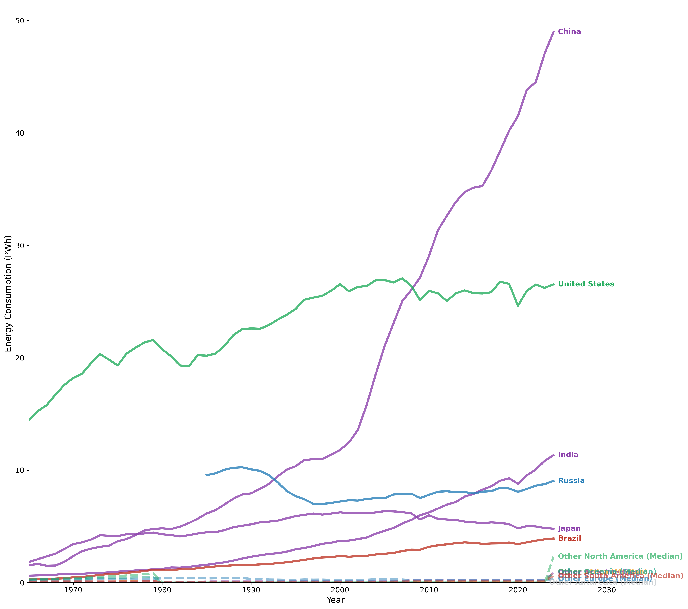
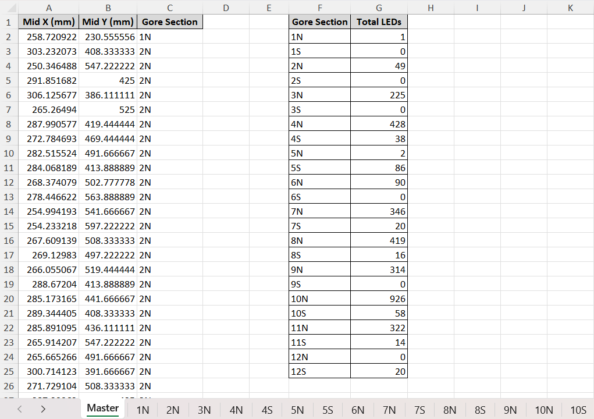

# Project Overview

This project is an **open-source platform for defining and exploring global energy distribution**. 

It is designed to **visualise energy consumption** with the aim of **designing solutions to meet growing energy demands**, particularly focused on future systems like a **global solar grid** or other regional energy models. While the primary aim of this project is to provide a **platform for problem-solving** in global energy distribution, it also serves as an **artistic and visually striking representation** of the world’s energy demand, using LEDs to highlight hotspots of energy-usage around the world. The LED globe offers a powerful way to **engage with global energy data through a tangible, functional model**. This artistic element helps communicate the disparities in energy usage across regions and countries, making the data more accessible to a wider audience.

The goal of this project is to help define the problem of energy distribution at a global scale, inviting others to **contribute** and use this **platform to explore potential solutions**.

# Background

### Building the Globe

The project uses a **1.27-metre-diameter spherical globe** made up of **12 gores** constructed from flexible printed circuit boards (PCBs) with surface-mounted LEDs. These 12 gores are divided in half at the equator, resulting in **24 total strips** of flexible PCB (each 1m x 0.333m in size). 

The choice of a 1.27 m diameter for the globe is no coincidence – this corresponds to 5.1 m2 of surface area, which is precisely 100 trillion times smaller than our Earth's surface area. Taking the Earth's total annual energy consumption (*primary energy* – not just electricity) of ~172 PWh and computing an average power of 20.4 TW over 8760 hours per year, we find that the scaled-down power draw of our model Earth is just over 0.2 Watts. 
Using green 0805 SMD (surface-mounted device) LEDs, it was found that an acceptable brightness could be generated using a mere 23.7 μA (*yes – 0.0237 mA*) at 2.12 V. With a supplied power of 0.2 W, almost 4000 of these LEDs could be powered. 3500 LEDs was chosen to provide a decent balance of brightness and quantity.

If we imagine **all** of this energy being supplied by solar photovoltaic (PV) and neglect energy storage and losses in transmission, we would need about 102 TWp (*peak* or *rated*) of solar PV. This would correspond to about 500,000 km2 of solar PV, assuming a peak sun irradiance of 1000 W/m2, an average sun irradiance of 200 W/m2 (capacity factor of 0.2), and a PV module efficiency of 20%. This was based on the climate in Prince Edward Island, Canada, but this obviously varies by geography (and is significantly better near the equator!). This corresponds to **dedicating about 0.1% of the Earth's surface area** to solar power generation infrastructure – or about 0.345% of its land surface area.

Alternatively, the analysis can be refined to calculate the PV required to replace only the portion of energy currently provided by fossil fuels (140 of the 172 PWh). For this, 80 TWp of solar would need to be installed, resulting in an area of 400 000 km² needed for the PV infrastructure. This would require just 0.0783% of the Earth’s surface area to be allocated to solar generation infrastructure, or 0.270% of its land mass.

With the calculated requirement of 0.1002% of Earth’s surface area to be dedicated to PV arrays, this results in a mere 51.1 cm2 of total area on the model: just larger than a **7 cm × 7 cm square**. Put out your hands and imagine this 7x7 cm square – this is enough to power the entire (scaled-down) globe! This supplies 1.02 Wp in the scaled-down sphere: an average power of 0.2 W. This would be enough power, on average, to run our 3500 LEDs at 2.12 V, 23.7 μA.

### Assigning LEDs

The 3500 LEDs are then **allocated proportionally to each country based on their energy usage**. However, even with almost 3500 LEDs, we can only represent the top 113-consuming countries. This means that any entity that uses less energy than Moldova – including nations like Nepal, Cameroon, Latvia, Luxembourg, and the Democratic Republic of the Congo – will not be represented on the map with even one LED. For a small island nation like the Cook Islands (#204 on the list), we would need over 180,000 LEDs globally for Cook Islands to be allocated a single diode.

For reference, here are the surface-mounted LEDs I'm referring to:

  
   
  <strong>Figure 1:</strong> SMD LEDs on a Millimetre Scale [<a href="https://www.pcboard.ca/led-0805" target="_blank">Source</a>]

These LEDs are then placed on the globe based on various metrics taken as proxies for global population density. Therefore, within a given country, let's say China, its 970 allocated LEDs will be placed in its most densely-populated areas, in the hopes that these also closely align with the areas where most of China's energy is being used.

To do this, this programme takes:
- geographic data *(shape file from Natural Earth)*
- either total or per capital energy usage per country *(csv updated dynamically from [Our World in Data](https://ourworldindata.org/energy-production-consumption))*
- and global population densities, approximated by:
  - global population density *(raster sourced from [Global Human Settlement Layer](https://human-settlement.emergency.copernicus.eu/download.php))*
  - built volumne *(raster sourced from [Global Human Settlement Layer](https://human-settlement.emergency.copernicus.eu/download.php))*
  - built surface area *(raster sourced from [Global Human Settlement Layer](https://human-settlement.emergency.copernicus.eu/download.php))*   
  - nighttime light rasters *(raster sourced from [Earth Observation Group](https://eogdata.mines.edu/products/dmsp/))*

While information on the energy usage per country is available for use, approximations for population density within a given country must be used to determine where geographically the country's allocated LEDs should go. This is due to the fact that energy usage rasters are not readily available (compared to population density rasters, which are). The built volume and surface area, as well as the nighttime light rasters can approximate geographical energy usage more closely than global population density, as industrial structures, such as ocean oil rigs, will consume large amounts of energy, despite having very low population density.

Both energy usage information and global population density information are available for multiple years, with the population densities measured every 5 years and going back as far as 1975, and measurements taken more frequently and going even further back for energy usage per country. This allows for a **comparison of historical energy distribution across the world**, as well as current energy distribution, which can show interesting trends.

The following image shows the placement of the LEDs for energy usage in 2023 in QGIS:

  
   
  <strong>Figure 2:</strong> Placement of 3647 LED Markers on a Mercator Projection in QGIS

Zooming into North America, we can inspect the tessellation of the LED markers. This population density raster resolution (*30 arc-minute, approx. 55km*) was chosen specifically so that it could accommodate the size of an 0805 SMD LED footprint, which is about 3.5 mm long – snugly fitting inside of the ~3.6 mm side length of one of these tiles when scaled down.

  
   
  <strong>Figure 3:</strong> North American LED Markers and Population Density Raster in QGIS

### Transforming Mercator Projection Coordinates to Gores

Once the LEDs are placed, the programme then outputs a scalable vector graphic of the 12 gores with countries and LED markers plotted, along with pick-and-place spreadsheets for PCB manufacturing. However, to do this, the coordinates of marked LEDs need to be translated onto gores. 

Per [Wikipedia](https://en.wikipedia.org/wiki/Gore_(segment)), "A gore is a sector of a curved surface or the curved surface that lies between two close lines of longitude on a globe and may be flattened to a plane surface with little distortion". While we have selected a quantity of 12 gore slices and flexible PCB material, this is still a projection after all, and thus there will still be distortion when attempting to flatten spherical segments onto flat gore strips. 

Spiros Staridas created a beautiful 12-gore map which we used as a reference:

  
   
  <strong>Figure 4:</strong> "Twelve Stripes of the Globe" from Spiros Staridas [<a href="https://www.staridasgeography.gr/twelve-stripes-of-the-globe/" target="_blank">Source</a>]

Transforming this Mercator projection to gores is no simple task, as GIS softwares such as QGIS do not support interrupted map projections. Therefore, Luke (with the excellent help of ChatGPT) created code that would perform the mathematical transformation from the latitude and longitude coordinates onto the flattened gore coordinates. This was the most intellectually challenging component of it, as we needed to account for the curvature of the Earth, adjust for the narrowing of the gores near the poles, and interpolate positions between the left and right boundaries of each gore based on latitude and longitude.

  
   
  
   
  <strong>Figures 5 and 6:</strong> GIFs Comparing Staridas' Gores to My Population Density Turbomap (Top) and SVG with Red LED Markers (Bottom)

# Results

### 12-Gore Scalable Vector Graphic Map

This leads us to the final visual result of the project: a 4000 mm wide by 2000 mm tall SVG. This graphic includes all 12 gores along with the 3467 LED markers as yellow rectangles of size 3.5 mm x 2 mm (the footprint of an 0805 SMD LED plus some small breathing room). You can inspect this SVG simply by right-clicking the image and selecting *Open image in new tab*, or by downloading it from `/outputs` and opening it in the vector graphics editor of your choice.

  
   
  <strong>Figure 7:</strong> Scalable Vector Graphic of the Gores Map with yellow LED Markers

### Learnings and Findings

The first interesting finding was just how unequal the world's energy usage is when dividing by political boundaries. For instance, in 2023, China used about 28% of the world's primary energy! If we have ~3500 LEDs, China is allocated almost 1000 of them, as shown in the figure below. *Of course, China is also extremely populous. When it comes to per-capita energy usage, countries like Canada, Norway, and Iceland use far more energy per person than China.* 

  
   
  <strong>Figure 8:</strong> Graph of Top 10 Countries by Primary Energy Consumption

The dominance in energy consumption seen from the top few nations – particularly China – is incredible. You can also see in the figure below just how closely packed the LEDs are for highly populated nations like China.

  
   
  <strong>Figure 9:</strong> Zoomed Capture from the SVG of East Asia

 South Korea is another a good example, and demonstrates the space limitations using this methodology – its landmass does not even have enough tiles to fit all of its LEDs. These LEDs are therefore placed dynamically in the ocean surrounding the country, in concentric 'rings' moving outwards from the border of the country until all the LEDs are placed. In 2023, ten nations were in this predicament, such as Singapore, Bahrain, and the UAE.

 Something else that is interesting to look at is energy consumption over time. In the figure below you can see the recent and meteoric rise in energy consumption by China, overtaking the United States a couple years after the turn of the milennium.  

 

  
   
  <strong>Figure 10:</strong> A graph of energy usage over time.

### Pick-and-Place Coordinates for PCB Manufacturing

The other useful output from this project is the creation of an Excel workbook containing a sheet for each half-gore which contains LEDs, along with a Master sheet with the totals for each gore half. These sheets contain the X and Y coordinates of the centroid of each surface-mounted component in mm, which is the standard for electronic design automation (EDA).

  
   
  <strong>Figure 11:</strong> Screen Capture of Pick-and-Place Excel Workbook

Interestingly, as seen in Figure 11, there are six gore halves which contain zero LEDs – can you identify them on the SVG map?

# Future Work
- Represent the 33 "missing" LEDs somehow; the top 113 countries own the first 3467 of 3500, leaving the remaining 99 entities to somehow share the last 33 LEDs.
- While a GUI has been implemented for some things, allowing users to choose the year or rasters to use, it would be useful to further **remove hard-coded variables**. Many of the functions are not appropriately generalizable using variables - num_gores, width, and height should really be editable in main and the script should function with arbitrary values, but those values are hardcoded in other scripts. There should also likely be some algorithmic checking to see if the proposed dimensions work with the proposed SMD sizes.
- Could add an option for users to do the population density turbo colourmap visual like in Figure 8; that was created during testing and is not currently part of this repo.
- All LEDs are currently run electrically in parallel with equal current to provide the same brightness. However, in the future, it would be best to utilize current-limiting resistors (of the same 0805 SMD style) on the back of the flexible PCB in order to have **variable-brightness LEDs**. This would enable more energy-intensive nations like Singapore to have visually brighter LEDs rather than just more of them, also meaning that LEDs would not need to be placed in the ocean surrounding countries that run out of space.
- **Draw the 51.1 cm2 area PV requirement**, likely as a square or circle, in the ocean just to show the size needed. Ideally, the PV would be real and would power the actual globe, perhaps using some sort of spotlight concentrated on this spot or even spread out logically around the globe in sensible places for PV (such as Nevada and other desert-like locations near the equator). This would mean adding locations for pads and vias for the solar cells to connect electrically.
- **Add physical connections**, like tabs and/or zero-ohm resistors, added strategically at the edges of the gore halves to assemble them.
- There should be an option in the code to **isolate a specific half-gore** rather than displaying all 12 full gores.
- Plan how to practically power/assemble/display this model whatever environment it will be displayed in.

# Sources and Software Used

### Data Sources:
- [Admin 0 – Countries](https://www.naturalearthdata.com/downloads/10m-cultural-vectors/10m-admin-0-countries/) from *Natural Earth* in 2022.
    - The shape file (`ne_10m_admin_0_countries.shp`) is the primary focus, but the `.cpg`, `.dbf`, and `.shx` supporting files are also necessary and are located in the `data/` folder.
- [Energy Production and Consumption](https://ourworldindata.org/energy-production-consumption) from *Our World in Data* by Hannah Ritchie, Pablo Rosado and Max Roser in 2024. Data is automatically pulled and updated using an API in `data handling/data_collector.py`.
- [global population density, build volume and surface area](https://human-settlement.emergency.copernicus.eu/download.php)) from *Global Settlement Layer*. 
    - Essential background in Pesaresi, M. et al. (2024) "Advances on the Global Human Settlement Layer by joint assessment of Earth Observation and population survey data", International Journal of Digital Earth, 17(1). 
    - The raster for the year is downloaded manually, then all data across the years is transformed into a single geopackage `.gpkg` file that is used by running `data handling/downsample.py` and `data handling/rasters_to_points.py`
    - This code must be run every time you download the new raster data and want to use it in the code
- nighttime light rasters *(raster sourced from [Earth Observation Group](https://eogdata.mines.edu/products/dmsp/))*
    - The raster for the year is downloaded manually, then all data across the years is transformed into a single geopackage `.gpkg` file that is used by running `data handling/downsample.py` and `data handling/rasters_to_points.py`
    - This code must be run every time you download the new raster data and want to use it in the code

### Useful Software:
- a python installation such as [miniforge](https://github.com/conda-forge/miniforge)
    - A free and open source language distribution for downloading and running the code
- [QGIS](https://qgis.org/download/)
    - This free and open source GIS (Geographic Information System) tool was invaluable in the learning and development process. It enabled me to inspect and edit LED marker placements and view my vector and raster layers.
- [Inkscape](https://inkscape.org/release/inkscape-1.3.2/)
    - This free and open source vector graphics editor was useful for inspecting the SVG (Scalable Vector Graphics) outputs.
- [KiCad](https://www.kicad.org/download/)
    - This free software suite for EDA was useful for learning about the requirements and workflow for PCB manufacturing, particlarly with respect to the footprints of SMD LEDs.

# Credits

### Primary Author: Luke McCarvill
Many thanks to Dr. Andrew Swingler, my supervisor in the UPEI Faculty of Sustainable Design Engineering, for coming up with this idea and supporting the process. Riley Fitzpatrick, my coworker and fellow UPEI FSDE student, was also instrumental, particularly in the early stages of the project, performing many of the scaling and PV calculations. 

Thank you to Dr. Eric Galbraith of McGill University for the idea of using the nighttime lights instead of population density – this will hopefully be incorporated in future versions.

Version two of this code was also worked on by Alexander Martin and An Mei Daniels. Legacy version is still visible under `branch/v2_nightlight`.

ChaptGPT (GPT-4o) was also used extensively in the programming and problem-solving process.

# Instructions for Installation and Usage

### 1. Clone the repository
First, clone the repository to your local machine:  
`git clone https://github.com/lukemccarvill/python-led-placing.git`  
`cd LED-Globe-Project/`

### 2. Install dependencies
Make sure you have Python 3.x installed. Install the required dependencies by running (depending on your python distribution):  
`pip install -r requirements.txt`  or `mamba install --yes --file requirements.txt`

This will install the necessary Python libraries like geopandas, pandas, rasterio, and matplotlib.

### 3. Run the Main Script
Run the `gui.py` script to generate the 4000x2000mm SVG map:  
`python src/gui.py`. This will first open a GUI interface, allowing the user to dynamically choose some parameters.

To adjust the final map image look, the user can select whether the followng are visible:
- gore outlines
- the equator line
- the country borders
- LED markers
- whether the coordinates are created in an Excel file for the manufacturer

The user can select the following parameters to change how the LEDs are allocated:
- what raster is used to determine where LEDs are placed
- what year is used

If the user is confident with editing the code, the user can also enter `src/main.py` and edit some parameters, such as the total number of LEDs allocated (`tot_leds`) or information about the globe size (e.g. `final_width` or `num_gores`).

### 4. View the Output
- The output SVG will be shown in Matplotlib; this figure should pop up automatically if there are no errors. Close any existing open Matplotlib figures before running the script.
- The output SVG file will be saved in the `outputs/` folder as `full_map_4m_by_2m.svg`.

### 5. Pick-and-Place File
If you enabled `Create coordinate spreadsheet for PCB manufacturing`, a pick-and-place Excel file with the LED coordinates for each gore half will be created. Each sheet in the file corresponds to one gore half for manufacturing. This `gorehalf_coordinates_with_sheets.xlsx` will be found in the `/outputs` folder.

For manufacturing, the flexible PCB can be designed with two layers: one dedicated to 2.12 V and the other to 0 V. This strategy simplifies the design, similar to solar PV cell design, by eliminating the need for thousands of individual traces and ensuring even power delivery across all LEDs. Hooking up the power supply at the North Pole would also probably be best. Then, these strips can be placed on some sphere like an inflatable balloon or even a rigid ball.

### Contributing
Contributions are welcome! If you'd like to work on any of those "future work" items or have other ideas for improving this project, feel free to:
- **Fork the repository** and submit a pull request with your improvements.
- **Report issues** or bugs via GitHub's issue tracker.
- **Start discussions** and/or ask questions in the Discussions tab.
