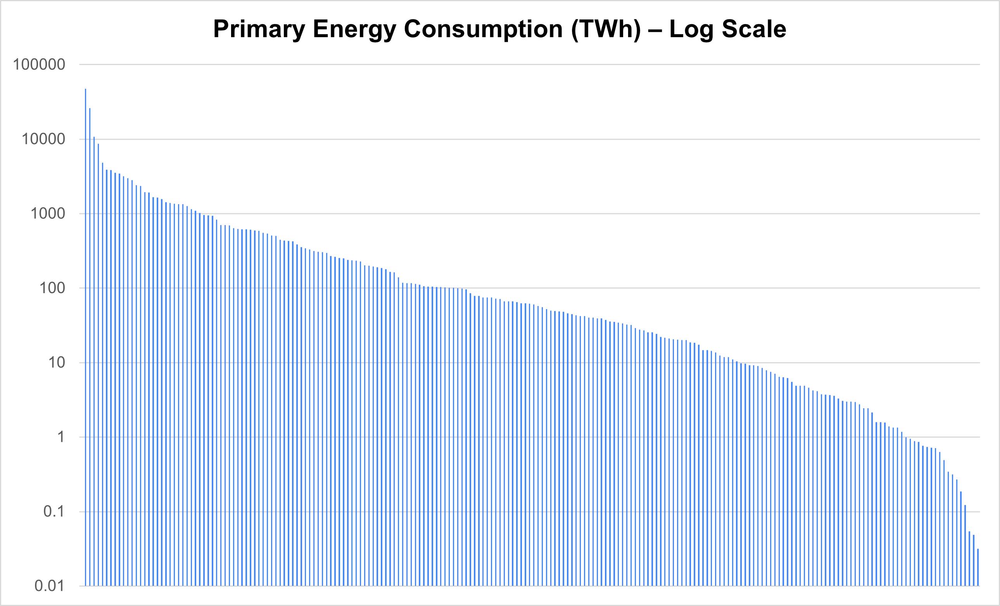

# Project Overview

This is meant to be a thought-provoking open-source project to model the globe's energy demand in a visually striking manner.
The chosen method of display is a 1.27-metre-diameter spherical globe made up of 12 gores constructed from flexible printed circuit board (PCB) with surface-mounted LEDs. These 12 gores in turn are divided in half at the equator, resulting in 24 total strips (each 1m x 0.333m in size) of flexible PCB.

This program takes in geographical data (shape file from Natural Earth using de facto boundaries), total energy usage per country (spreadsheet sourced from Our World in Data, then each country was given a share of the total LEDs based on energy usage), and a global population density raster (GeoJSON sourced from SEDAC). It then outputs a scalable vector graphic of the 12 gores with countries and LED markers plotted, along with pick-and-place CSV sheets for PCB manufacturing.

# Background

This 1.27 m diameter is no coincidence – this corresponds to 5.1 m^2 of surface area, which is precisely 100 trillion times smaller than our Earth's surface area.
Taking the Earth's total annual energy consumption (*primary energy* – not just electricity) of ~172 PWh and computing an average power of 20.4 TW over 8760 hours per year, we find that the scaled-down power draw of our model Earth is just over 0.2 Watts. 
Using green 0805 SMD LEDs, it was found that an acceptable brightness could be generated using a mere 23.7 uA (*yes – 0.0237 mA*) at 2.12 V. With a supplied power of 0.2 W, almost 4000 of these LEDs could be powered. 3500 LEDs was chosen to provide a decent balance of brightness and quantity.

If we imagine **all** of this energy being supplied by solar photovoltaic (PV) and neglecting energy storage and losses in transmission, we would need about 102 TWp (*peak* or *rated*) of solar PV. This would correspond to about 500,000 km^2 of solar PV, assuming a peak sun irradiance of 1000 W/m^2, an average sun irradiance of 200 W/m^2 (capacity factor of 0.2), and a PV module efficiency of 20%. This was based on the climate in Prince Edward Island, Canada, but this obviously varies by geography (and is significantly better near the equator!). This corresponds to **dedicating about 0.1% of the Earth's surface area** to solar power generation infrastructure – or  about 0.345% of its land surface area.

Alternatively, the analysis can be refined to calculate the PV required to replace only the portion of energy currently provided by fossil fuels (140 of the 172 PWh). For this, 80 TWp of solar would need to be installed, resulting in an area of 400 000 km² needed for the PV infrastructure. This would require just 0.0783% of the Earth’s surface area to be allocated to solar generation infrastructure, or 0.270% of its land mass.

With the calculated requirement of 0.1002% of Earth’s surface area to be dedicated to PV arrays, this results in a mere 51.1 cm2 of total area on the model: just larger than a **7 cm × 7 cm square**. Put out your hands and imagine this 7x7 cm square – this is enough to power the entire (scaled-down) globe! This supplies 1.02 Wp in the scaled-down sphere, supplying an average power of 0.2 W. This would be enough power, on average, to run our 3500 LEDs at 2.12 V, 23.7 uA.

# Challenges and Learnings

### China's Energy Dominance
The first interesting finding was just how unequal the world's energy usage is when dividing by political boundaries. For instance, China uses about 28% of the world's primary energy! If we have ~3500 LEDs, China is allocated almost 1000 of them, as shown in the figure below. *Of course, China is also extremely populous. When it comes to per-capita energy usage, countries like Canada, Norway, and Iceland use far more energy per person than China.*

  
   
  <strong>Figure 1: Graph of Top 30 Countries by Primary Energy Consumption</strong>

This is only the top 30 countries – let's instead include all 212 entities (193 countries plus some dependencies, microstates, etc. included by *Our World in Data*). The dominance in energy consumption seen from the top few nations – particularly China – is incredible.

  
  
   
  <strong>Figures 2 and 3: Comparison of All Countries' Energy Consumption (Linear vs. Log Scale)</strong>

### Number of LEDs (work in progress)

Even with almost 3500 LEDs, we can only represent top 113-consuming countries. This means that any entity that uses less energy than Moldova – including nations like Nepal, Cameroon, Latvia, Luxembourg, and the Democratic Republic of the Congo – will not be represented on the map with even one LED. For a small island nation like the Cook Islands (#204 on the list), we would need over 180,000 LEDs globally for Cook Islands to be allocated a single diode.

Now, we know how many LEDs that a given country should have, but how do we go about deciding where to place each LED within a given country? Given that energy usage rasters (geographical data) are not readily available at a global scale, the next best option that I thought of was using population density. These GeoTiff rasters are readily available in many resolutions and likely track well enough with energy usage that they would appear to be a reasonable analogue for energy usage to most viewers of the model globe. *In retrospect, it likely would have been better to use [Nighttime Lights](https://eogdata.mines.edu/products/dmsp/) instead, but that is future work.* Therefore, within a given country, let's say China, we will place its 970 allocated LEDs in its most densely-populated areas, and we will hope that these also closely align with the areas where most of China's energy is being used.

- image of china zoomed in

The following image shows the placement of the LEDs in QGIS:

  
   
  <strong>Figure 4: Placement of 3647 LED Markers on a Mercator Projection in QGIS</strong>

Zooming into North America, we can inspect the tessellation of the LED markers. This population density raster resolution (*30 arc-minute, approx. 55km*) was chosen specifically so that it could accommodate the size of an 0805 SMD LED footprint, which is about 3.5 mm long – snugly fitting inside of the ~3.6 mm side length of one of these tiles when scaled down.

  
   
  <strong>Figure 5: North American LED Markers and Population Density Raster in QGIS</strong>

### Transforming Mercator Projection Coordinates to Gores

Once we have the LEDs marked as coordinates in a GIS software, we then somehow need to get this beautiful creation from QGIS onto gores. Per [Wikipedia](https://en.wikipedia.org/wiki/Gore_(segment)), "A gore is a sector of a curved surface or the curved surface that lies between two close lines of longitude on a globe and may be flattened to a plane surface with little distortion". While we have selected a quantity of 12 gore slices and flexible PCB material, this is still a projection after all, and thus there will still be distortion when attempting to flatten spherical segments onto flat gore strips. 

Spiros Staridas created a beautiful 12-gore map which I used as a reference:

  
   
  <strong>Figure 6: "Twelve Stripes of the Globe" from Spiros Staridas [<a href="https://www.staridasgeography.gr/twelve-stripes-of-the-globe/" target="_blank">Link</a>]</strong>

Transforming this Mercator projection to gores is no simple task, as GIS softwares such as QGIS do not support interrupted map projections. Therefore, it was up to me (with the excellent help of ChatGPT) to create code that would perform the mathematical transformation from the latitude and longitude coordinates onto the flattened gore coordinates. This was the most intellectually challenging component of it, as we needed to account for the curvature of the Earth, adjust for the narrowing of the gores near the poles, and interpolate positions between the left and right boundaries of each gore based on latitude and longitude.

  
  
   
  <strong>Figures 7 and 8: GIFs Comparing Staridas' Gores to My Population Density Turbomap (Left) and SVG with Red LED Markers (Right) </strong>

### Misc (work in progress)

There were many other challenges along the way, such as:
- How do we feasibly produce PCB's this large (*recall – the circumfrence of this globe is 4 m long!*), even if they are in gore strips?
- How to deal with significant concentrations of LED placements for highly-populated areas (particularly eastern China), and how closely can we tesselate these LEDs safely on the PCB?
- How do we decide where to place a nation's LEDs if it is too small to fit them? Singapore, for example, was allocated 20 LEDs but only enough tiles for two!
- ... and many programming/debugging challenges with these large datasets!

# Future Work (work in progress)

- This project uses population density within a given country to determine where geographically the country's allocated LEDs should go, since energy usage rasters are not readily available compared to population density rasters. This should instead be changed to utilize actual energy usage rasters OR using nighttime lights rasters, like from Earth Observation Group.
- All LEDs are run electrically in parallel with equal current to provide the same brightness. However, in the future, it would be best to utilize current-limiting resistors (of the same 0805 SMD style) on the back of the flexible PCB in order to have variable-brightness LEDs. This would enable more energy-intensive nations like Singapore to have visually brighter LEDs rather than just more of them.
- Draw the 7x7cm square in the ocean just to show the size needed.

# Sources and Software Used

### Data Sources:
- [Energy Production and Consumption](https://ourworldindata.org/energy-production-consumption) from *Our World in Data* by Hannah Ritchie, Pablo Rosado and Max Roser in 2024.
    - Navigate down on the webpage to "Primary energy consumption, 2023", then download "Full data (CSV)". I cleaned and sorted the data and placed it in the `data/` folder. It is titled `Country Energy Data.xlsx`.
- [Gridded Population of the World (GPW), v4](https://sedac.ciesin.columbia.edu/data/set/gpw-v4-population-density-rev11/data-download) from *Socioeconomic Data and Applications Center (SEDAC)* in 2020.
    - Login required to download raster data. Select *Single Year*, *GeoTiff*, and *30 Minute (approx. 55km)*. It is titled `gpw_v4_population_density_rev11_2020_30_min.tif` in the `data/` folder.
    - The 30 arc-minute resolution was selected so that each tile in the raster would be able to accomodate an 0805 SMD LED, but depending on your needs/desires, you can select a different resolution.
- [Admin 0 – Countries](https://www.naturalearthdata.com/downloads/10m-cultural-vectors/10m-admin-0-countries/) from *Natural Earth* in 2022.
    - The shape file (`ne_10m_admin_0_countries.shp`) is the primary focus, but the `.cpg`, `.dbf`, and `.shx` supporting files are also necessary and are located in the `data/` folder.

### Useful Software:
- [QGIS](https://qgis.org/download/)
    - This free and open source GIS (Geographic Information System) tool was invaluable in the learning and development process. It enabled me to inspect and edit LED marker placements and view my vector and raster layers.
- [Inkscape](https://inkscape.org/release/inkscape-1.3.2/)
    - This free and open source vector graphics editor was useful for inspecting the SVG (Scalable Vector Graphics) outputs.
- [KiCad](https://www.kicad.org/download/)
    - This free software suite for electronic design automation (EDA) was useful for learning about the requirements and workflow for PCB manufacturing, particlarly with respect to the footprints of SMD LEDs.

# Credits

### Primary Author: Luke McCarvill
Many thanks to Dr. Andrew Swingler, my supervisor in the UPEI Faculty of Sustainable Design Engineering, for coming up with this idea and supporting the process. Riley Fitzpatrick, my coworker and fellow UPEI FSDE student, was also instrumental, particularly in the early stages of the project, performing many of the scaling and PV calculations.

ChaptGPT (GPT-4o) was also used extensively in the programming and problem-solving process.

# Instructions for Installation and Usage (work in progress)
- Clone the repo...
- If you wish to manually edit the LED positions, you can place an edited GeoJSON file in the `data/` folder (such as the one I've supplied using my own edits) and set the `use_edited_geojson` flag to `True` in `src/main.py`. The script will automatically load this file instead of generating a new one. If no such file exists or the `use_edited_geojson` flag is set to `False`, the script will generate a new GeoJSON file for manual manipulation.
- test1
- test2
- test2.2
- test3